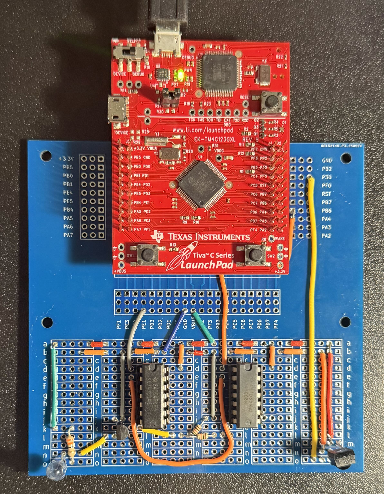

# IR-UART Communication System (TM4C123GXL)

This is my CSE 3442 Embedded Systems 1 term project. The goal is to send and receive UART data over IR using an IR333A IR LED and a TSOP134 IR receiver.

The main issue is the TSOP134 only works when the IR light is flashing at 38 kHz. So you cannot just send normal UART data into the LED and expect it to work.

So the solution is basically UART + PWM + logic gates.

## What it does
- You type a message on the PC terminal
- Board A reads it on UART0 (115200 8N1)
- Board A sends it out on UART7 (300 8E1), then the data gets inverted, ANDed with a 38 kHz PWM signal, and the output goes and transmits the data using the IR LED
- Board B receives it on UART7 RX using an interrupt, rebuilds the message, and prints it back to the PC terminal

## How it works (high level)
1. PWM on PB6 generates a 38 kHz signal.
2. UART7 TX on PE1 sends the data (300 8E1).
3. The UART7 TX signal is inverted (TSOP134 output is active low / default high).
4. The inverted UART signal is ANDed with the 38 kHz PWM so the IR receiver can read the data.
5. That signal drives a 2N3904 transistor circuit that powers the IR333A from 5 V.
6. TSOP134 output goes to PE0 (UART7 RX). A UART RX interrupt collects bytes until the terminator and prints the recovered string over UART0.

## Project Diagram + Photos
This is the high level block diagram of the system (same one from my report). It was made using paint.net and LTSpice:

   

This is the photo of the project built on a breadboard:

   

This is the final, soldered version of the project:

   

## Pins used
- UART0 RX/TX: PA0 / PA1 (PC terminal)
- UART7 RX/TX: PE0 / PE1 (IR data)
- PWM (38 kHz): PB6

## Hardware used
- 2x TM4C123GXL LaunchPad
- IR333A IR LED + TSOP134 receiver
- 74HC04 (NOT) + 74HC08 (AND)
- 2N3904 NPN transistor
- Resistors (see circuit report)

## Testing notes
- Verified UART7 first using a direct loopback (PE1 to PE0) to confirm the RX interrupt logic worked
- Verified the 38 kHz PWM and the final LED drive signal on the scope
- Built on breadboard first, then finalized on perfboard

## Docs
Project reports, diagrams, and the datasheets are in `docs/`.